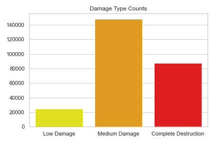
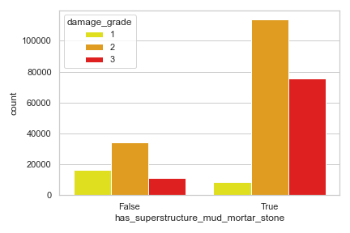
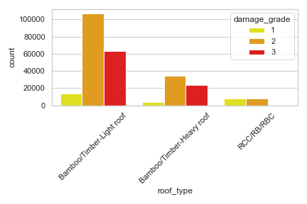
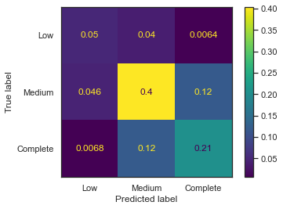
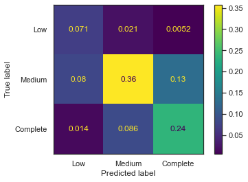

# Capstone-Modeling-Earthquake-Damage

Capstone project for Flatiorn School

## Repo Info

### Folders

Data: Data used for this repo. (due to size original data not included link at bottom)  
Images: All images used for this repo.  
PDF: PDF forms of capstone deliverables: Final_Notebook.ipynb, Presentation Slide Deck.pdf, and README.md  
Pickle: Models that are pickle for faster computation time when running notebook. (due to size bigger models not included in this repo)  
Working Notebook: Olded note books that was saved when making changes and wanted to keep the old notebook.  

### Files

Final_Notebook.ipynb: Fisished tech notebook.  
Presentation Slide Deck.pdf: This is the slide deck that was used when doing final capstone presentation.  
README.md: You are currently reading this.  

### Links

Data Used: https://www.drivendata.org/
Original Data: http://eq2015.npc.gov.np/#/
Presentation: https://github.com/WolfnChaos/Capstone-Modeling-Earthquake-Damage/blob/main/Presentation%20Slide%20Deck.pdf
Final Notebook: https://github.com/WolfnChaos/Capstone-Modeling-Earthquake-Damage/blob/main/FInal_Notebook.ipynb

## Overview

A magnitude 7.8 earthquake struck Nepal on April 25, 2015, toppling multi-story buildings in Kathmandu, the capital, and creating landslides and avalanches in the Himalaya Mountains. Nearly 9,000 people died and more than 22,000 suffered injuries.

The quake was followed by hundreds of aftershocks, and only 17 days later, there was another major quake, a magnitude 7.3 temblor. Thirty-nine of the nation’s 75 districts with a population of 8 million people — about a third of the national population — were affected. Hundreds of thousands of people lost everything and faced extreme poverty. 

More than 600,000 homes were destroyed and more than 288,000 were damaged in the 14 worst-hit districts. Hundreds of thousands of people lost everything and faced extreme poverty and homeless. 

## Business Problem

The Federal Democratic Republic of Nepal wants to avoid future building damages by reinforcing homes/buildings. They are wanting to know the possible damage risk level that current homes/buildings are at. So, they can better focus their resources, and protect their citizens of Nepal if and when another major earthquake occurs.

## Data Understanding

The data that will be used to predict the damage risk level comes from https://www.drivendata.org/, while original data comes from http://eq2015.npc.gov.np/#/. One of the largest dataset done on the aftermath of an earthquake.

The dataset mainly consists of 260601 rows each with information on the building structure and ownership. There are 40 columns in this dataset, where the building_id column is a unique and the target. The remaining 38 features are described in the section below. 

Driven Data also obfuscated random lowercase ascii characters to the categorical variables. Using the some of the original data we should be able to find out what this varilbes are and hopefully get some insight when doing the Exploratory Data Analysis (EDA).

### Target

|Target| Info|
|:-----| :-----|
|Grade 1| represents low damage|
|Grade 2| represents a medium amount of damage|
|Grade 3| represents almost complete destruction|

### Features

|Feature| Info|
|:-----| :-----|
|geo_level_1_id, geo_level_2_id, geo_level_3_id (type: int):| geographic region in which building exists, from largest (level 1) to most specific sub-region (level 3). Possible values: level 1: 0-30, level 2: 0-1427, level 3: 0-12567.|
|count_floors_pre_eq (type: int):| number of floors in the building before the earthquake.|
|age (type: int):| age of the building in years.|
|area_percentage (type: int):| normalized area of the building footprint.|
|height_percentage (type: int):| normalized height of the building footprint.|
|land_surface_condition (type: categorical):| surface condition of the land where the building was built. Possible values: n, o, t.|
|foundation_type (type: categorical):| type of foundation used while building. Possible values: h, i, r, u, w.|
|roof_type (type: categorical):| type of roof used while building. Possible values: n, q, x.|
|ground_floor_type (type: categorical):| type of the ground floor. Possible values: f, m, v, x, z.|
|other_floor_type (type: categorical):| type of constructions used in higher than the ground floors (except of roof). Possible values: j, q, s, x.|
|position (type: categorical):| position of the building. Possible values: j, o, s, t.|
|plan_configuration (type: categorical):| building plan configuration. Possible values: a, c, d, f, m, n, o, q, s, u.|
|has_superstructure_adobe_mud (type: binary):| flag variable that indicates if the superstructure was made of Adobe/Mud.|
|has_superstructure_mud_mortar_stone (type: binary):| flag variable that indicates if the superstructure was made of Mud Mortar - Stone.|
|has_superstructure_stone_flag (type: binary):| flag variable that indicates if the superstructure was made of Stone.|
|has_superstructure_cement_mortar_stone (type: binary):| flag variable that indicates if the superstructure was made of Cement Mortar - Stone.|
|has_superstructure_mud_mortar_brick (type: binary):| flag variable that indicates if the superstructure was made of Mud Mortar - Brick.|
|has_superstructure_cement_mortar_brick (type: binary):| flag variable that indicates if the superstructure was made of Cement Mortar - Brick.|
|has_superstructure_timber (type: binary):| flag variable that indicates if the superstructure was made of Timber.|
|has_superstructure_bamboo (type: binary):| flag variable that indicates if the superstructure was made of Bamboo.|
|has_superstructure_rc_non_engineered (type: binary):| flag variable that indicates if the superstructure was made of non-engineered reinforced concrete.|
|has_superstructure_rc_engineered (type: binary):| flag variable that indicates if the superstructure was made of engineered reinforced concrete.|
|has_superstructure_other (type: binary):| flag variable that indicates if the superstructure was made of any other material.|
|legal_ownership_status (type: categorical):| legal ownership status of the land where building was built. Possible values: a, r, v, w.|
|count_families (type: int):| number of families that live in the building.|
|has_secondary_use (type: binary):| flag variable that indicates if the building was used for any secondary purpose.|
|has_secondary_use_agriculture (type: binary):| flag variable that indicates if the building was used for agricultural purposes.|
|has_secondary_use_hotel (type: binary):| flag variable that indicates if the building was used as a hotel.|
|has_secondary_use_rental (type: binary):| flag variable that indicates if the building was used for rental purposes.|
|has_secondary_use_institution (type: binary):| flag variable that indicates if the building was used as a location of any institution.|
|has_secondary_use_school (type: binary):| flag variable that indicates if the building was used as a school.|
|has_secondary_use_industry (type: binary):| flag variable that indicates if the building was used for industrial purposes.|
|has_secondary_use_health_post (type: binary):| flag variable that indicates if the building was used as a health post.|
|has_secondary_use_gov_office (type: binary):| flag variable that indicates if the building was used fas a government office.|
|has_secondary_use_use_police| binary| flag variable that indicates if the building was used as a police station.|
|has_secondary_use_other (type: binary):| flag variable that indicates if the building was secondarily used for other purposes.|

### Limitations

Being that the target of this dataset has an imbalance class count could be an issues when trying to get insights during exploratory data analysis and have an issues for pick features for modeling.

## Data Preparation

The main dataset that is being used dosen't have any missing values but some of the features are boolean but read as int64. Using a loob to change the type of this features from int64 to bool. Now all the categorical columns are represented by an obfuscated random lowercase ascii character, we can use the some of the original dataset to find out what the letters represent. 

### land_surface_condition

|Value| Count|
|:-----| :-----|
|Flat| 631675|
|Moderate slope| 105640|
|Steep slope| 24791|
| | |
|t| 216757|
|n| 35528|
|o| 8316|

Looking at the print out it looks like most of the random values in the dataset do correspond to the original dataset. Will use the values to replace the random values.

## Exploratory Data Analysis (EDA)

### Class Counts

Lets take a look at are target classes and see what kind of counts we have.

Looks like are classes are imbalance this may cuase an issues down the road when we start training are models.

### Categorical Columns

#### Superstructure

Well over half of the structures are made form a mix of mud, mortar and stone, yet the one that aren't have more buildings with low damage then the once that didn't.

#### Roof Types

Seems like almost all roof types are made of Bamboo and Timber ranging from light to heavy roofs. They seem to have equal matching precentages acoss the three damage grades while buildings that have RCC/RB/RBC has equal amounts of low and med with no grade 3 damage.

## First Simple Model (FSM)

For the FSM we will use just the numerical and boolean columns and the classifier we will use a Decision Tree Classifer.

|Score Type| Model Scores|
|:-----| :-----|
|Accuracy:| 0.9742082374008698|
|Recall:| 0.9746926003984552|
|Precision:| 0.969726887943331|
|F1:| 0.9718795910888217|
|||
|Accuracy:| 0.6604503384445365|
|Recall:| 0.6149900294776912|
|Precision:| 0.6073121797582424|
|F1:| 0.6109604665814518|

The training recall score for the FSM is 0.97 and the test is 0.61 a sure sign that the model is over fit whict tree tend to do.

## Preprocessing

For the preprocessing for the vanilla models not much will be done being that the dataset was most clean, however the categorical will be one hot encoding. Being that class labels are imbalanced SMOTE will be used to handle this issues.

## Vanilla Models

Now we will use the prepocessed data to train and test some vms. The models that we will be using are: KNeighborsClassifier, GaussianNB, LogisticRegression, Random Forest Classifer, and XGB Classifer.

### KNeighborsClassifier

|Score Type| Model Scores|
|:-----| :-----|
|Accuracy:| 0.7765106165259658|
|Recall:| 0.8258946020229|
|Precision:| 0.7263370691321113|
|F1:| 0.7572691464515654|
|||
|Accuracy:| 0.6634894322420224|
|Recall:| 0.6880816897257244|
|Precision:| 0.611128539767606|
|F1:| 0.633385319526554|

### GaussianNB

|Score Type| Model Scores|
|:-----| :-----|
|Accuracy:| 0.4222665643387056|
|Recall:| 0.5238633447369136|
|Precision:| 0.4820254810161683|
|F1:| 0.40525117631533075|
|||
|Accuracy:| 0.42341637119921416|
|Recall:| 0.5273272948650579|
|Precision:| 0.48493843628601613|
|F1:| 0.4088181014009207|

### LogisticRegression

|Score Type| Model Scores|
|:-----| :-----|
|Accuracy:| 0.31900741877718086|
|Recall:| 0.4429848109015096|
|Precision:| 0.390518064280658|
|F1:| 0.31276640307165304|
|||
|Accuracy:| 0.31981090083037866|
|Recall:| 0.44670901581043837|
|Precision:| 0.39240549793664053|
|F1:| 0.3140840623426468|

### RandomForestClassifer

|Score Type| Model Scores|
|:-----| :-----|
|Accuracy:| 0.987347147608084|
|Recall:| 0.9863663087424103|
|Precision:| 0.9868241824104965|
|F1:| 0.9865946036710954|
|||
|Accuracy:| 0.7112400423631257|
|Recall:| 0.6413932752904922|
|Precision:| 0.6824085851726417|
|F1:| 0.6582082249518132|

### XGBClassifer

|Score Type| Model Scores|
|:-----| :-----|
|Accuracy:| 0.733251470964441|
|Recall:| 0.6606636902763361|
|Precision:| 0.72117487377136|
|F1:| 0.6845419811772505|
|||
|Accuracy:| 0.7216312873171555|
|Recall:| 0.6446161127629831|
|Precision:| 0.7007266196691101|
|F1:| 0.6667827021617386|

Out of the five models that was ran, KNeighborsClassifier had both the highest train/test scores. Random Forest Classifer had the highest train score, but being that Random Forest tents to over fit easy. Will be using both of these models for hyperparameter tuning in the following GridSearch.

The best model out of the Vanilla Models 15.6% for the test data are being classified as a false negative.

## GridSearchCV

The first thing that needs to be done is that pipelines and a parameter grid need to be set up for the two classifiers that are going to be hyperparameter tuned. Then the grid searches for both models just need to be ran and will use the function print_scores to check how each model performed. And check the best parameter for both as well.

### KNeighorsClassifier

Best Recall Score: 0.6965513290275445

|Params| Value|
|:-----| :-----|
|n_jobs:| -1|
|n_neighbors:| 10|
|p:| 1|
|weights:| uniform|

|Score Type| Model Scores|
|:-----| :-----|
|Accuracy:| 0.748119723714505|
|Recall:| 0.7940375301737518|
|Precision:| 0.6971429279434084|
|F1:| 0.7264383087951195|
|||
|Accuracy:| 0.6826295835827539|
|Recall:| 0.7084329101607633|
|Precision:| 0.6293136855468423|
|F1:| 0.6529252985576525|

### RandomForestClassifier

Best Recall Score: 0.6340557495650673

|Params| Value|
|:-----| :-----|
|bootstrap:| True|
|max_depth|| None|
|max_features:| auto|
|min_samples_leaf:| 2|
|min_samples_split:| 10|
|n_estimators:| 1000|

|Score Type| Model Scores|
|:-----| :-----|
|Accuracy:| 0.8251573292402149|
|Recall:| 0.7738318805178436|
|Precision:| 0.8247552934891266|
|F1:| 0.7952232273315998|
|||
|Accuracy:| 0.7174103237095363|
|Recall:| 0.6468860046567152|
|Precision:| 0.6914801874479407|
|F1:| 0.66413389851544|

## Final Model Evaluation

With the recall test score being 70.8% the k neighors classifer is still the best model after using grid scearch to hyperparameter tune. With the first simple model being 61.5% that is an impovement of 9.3%. Using this current model we can classify a Napal building's damage grade level, if and only 29.2% of the time will the building be misclassified as a lower level if and when another major earthquake occurs.

Taking a look at the confusion matrix for k neighors grid search we can see that now we are only classifying 13.2% which is 3.4% that are no longer being missclassified compared to the first simple model.

### Feature Importance

In order to get the feature importance from an KNeighors Classifier we will have to use permutation_importance from sklearn inspection.

|Feature| Importance|
|:-----| :-----|
|roof_type| 9.722495|
|foundation_type| 9.610197|
|other_floor_type| 1.320333|
|position| 0.162649|
|land_surface_condition| 0.114191|
|geo_level_1_id| 0.076375|
|count_floors_pre_eq| 0.061661|
|geo_level_2_id| 0.056982|
|plan_configuration| 0.047470|
|count_families| 0.045260|

Now that we have the feature importance from the final model we can see that roof type and founfation type are the top two most important features.
